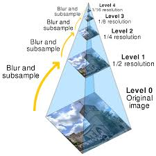

<p align="center">
Figure 1. Object Detection with YOLOv3
</p>
I've been working with Object Detection as long as I started exploring Computer Vision and building projects in my college but I never really documented what I learned so here's my attempt at laying out all that I know about Object Detection.I will be focusing on Object Detection with Deep Learning since it's all the rage these days but you can expect an article on Detection with core CV algos soon. 

Since this is an overview it is going to be fairly theoretical, you do not need any programming experience but you should have a basic understanding of what a `CNN` is and a mild idea of how it works. So let's dive right in.

**Object Classification vs Object Localization vs Object Detection**
While Object Classification is the process of identifying what object is present in the image,Object localization on the other hand is determining the position of that classified object in the image.
Object Detection is the process of identifying how many objects are in an Image/Video and what they are, for example you can expect from an Object detector to tell you that an image contains a Car, a child and a bicycle along with their position in the image and depending on how robust and accurate it is, there might just be all of these things present in that image at those positions.
<p align="center">

</p>
<p align="center">
Figure 2. Object Localization vs Object Detection
</p>

Now let's explore the theory behind how these detectors work. When an image is fed to a `CNN`, it outputs which object it thinks is present in that image but is not able to tell you where the object lies within that image, this is where ODs* come in. Apart from predicting which objects are present, they also output the bounding box co-ordinates for those objects.We will first look at the most basic algorithm implemented for this task, it involves Sliding Window convolutions and extraction of regions -> `CNN` classification of extracted regions -> discarding less probable bounding box co-ordinates for the same object.

Now we should walk through the above steps sequentially. 

1.) We use sliding windows to extract different portions of the image,for this we go over the images  in strides and extract the respective portion.This part is called Region of Interest(RoI) extraction 

2.) This extracted portion is then fed to a trained** `CNN` for classification (This the only part where Deep Learning is used in our simple Detector) and the predictions,confidence score and bounding box co-ordinates for each portion stored in a dictionary (hashmap for non-Pythonistas). This is the Object Classification part.

3.) Once we have all the outputs and predictions, we will notice that there are multiple bounding boxes for each object in the image since many sliding windows may have extracted different portions of the same object and the `CNN` has correctly classified them. At this point we discard the boxes with less confidence scores ad for each object detected only keep the box with highest score.This is achieved via an algorithm called `Non-Max suppression`  

So now we have our *Theoretical* little Object Detector ready and working and say it works well but there's always room for improvement, so we look for potential performance leaks in our little detector.

The **First** problem with the above approach is fixed size, say we have an object bigger than the size of the sliding window, then none of the extracted portions will contain the whole object and the `CNN` may not classify it correctly. To solve the above problem we use a technique called the ```Image Pyramid```. It refers to different variants of image that have different sizes with the smallest one on the top and the lowest having the biggest(original) size which, if you try to visualize, looks like a pyramid, see  figure 1.

<p align="center">

</p>
<p align="center">
Figure 3. `Image Pyramids` with scaling_factor=0.5
</p>
<!--  -->

The **Second** thing as we can see is that we are classifying all the extracted portions of an image most of these portions may not contain the object so we are classifying useless regions (see Figure 2) and since a forward pass of our `CNN` is not cheap, it consumes a lot of time in doing so. Also the process of making an `Image pyramid` adds additional overhead. One thing we can do to minimize this overhead is to break down the image into segments that may or may not contain an object, extract RoI from only those segments which contain an object and discard the rest.For this Segment classification the simplest algorithm we have is called `selective search`. In fact this Idea was the basis for `RCNN` and is called Region Proposal, though it was not implemented with the help of `selective search`.

<p align="center">

</p>
<p align="center">
Figure 4. Areas with no objects in the images  
</p>

**Thirdly**, Our implementation has a lot of fixed parts like the scale of `Image pyramids` and the filter size for RoI extraction and is not trainable i.e we cannot tune the classifier or the RoI extraction parts based on the amount of error it makes when detecting objects in images.

This part was just about building an intuition of Object Detection fundamentals so that we can appreciate the different architectures of popular OD approaches. In the part 2 of this blog we will look at `RCNN` architectures and its code.

*OD is the abbreviation for Object Detection or Object Detector as the usage be.

**`CNN` can be trained on ImageNet or CIFAR-100 or any other Image classification dataset but note that this will affect the performance of our detector as there are more classes in some of the datasets hence we can detect more classes of objects with these datasets.

Figure 1 source - "https://cdn.analyticsvidhya.com/wp-content/uploads/2019/08/real_time_object_detection.jpg" \
Figure 2 source - "https://cdn.analyticsvidhya.com/wp-content/uploads/2019/08/Screenshot-from-2019-08-02-16-50-12.png
" \
Figure 3 source - "https://en.wikipedia.org/wiki/File:Image_pyramid.svg" \
Figure 4 source - "https://www.coursera.org/lecture/convolutional-neural-networks/optional-region-proposals-aCYZv"


<!-- Observables are lazy Push collections of multiple values. They fill the missing spot in the following table:

| | Single | Multiple |
| --- | --- | --- |
| **Pull** | [`Function`](https://developer.mozilla.org/en-US/docs/Glossary/Function) | [`Iterator`](https://developer.mozilla.org/en-US/docs/Web/JavaScript/Reference/Iteration_protocols) |
| **Push** | [`Promise`](https://developer.mozilla.org/en-US/docs/Mozilla/JavaScript_code_modules/Promise.jsm/Promise) | [`Observable`](../class/es6/Observable.js~Observable.html) |

**Example.** The following is an Observable that pushes the values `1`, `2`, `3` immediately (synchronously) when subscribed, and the value `4` after one second has passed since the subscribe call, then completes:

```typescript
import { Observable } from 'rxjs';

const observable = new Observable(subscriber => {
  subscriber.next(1);
  subscriber.next(2);
  subscriber.next(3);
  setTimeout(() => {
    subscriber.next(4);
    subscriber.complete();
  }, 1000);
});
```

To invoke the Observable and see these values, we need to *subscribe* to it:

```typescript
import { Observable } from 'rxjs';

const observable = new Observable(subscriber => {
  subscriber.next(1);
  subscriber.next(2);
  subscriber.next(3);
  setTimeout(() => {
    subscriber.next(4);
    subscriber.complete();
  }, 1000);
});

console.log('just before subscribe');
observable.subscribe({
  next(x) { console.log('got value ' + x); },
  error(err) { console.error('something wrong occurred: ' + err); },
  complete() { console.log('done'); },
});
console.log('just after subscribe');
```

Which executes as such on the console:

```none
just before subscribe
got value 1
got value 2
got value 3
just after subscribe
got value 4
done
```

## Pull versus Push

*Pull* and *Push* are two different protocols that describe how a data *Producer* can communicate with a data *Consumer*.

**What is Pull?** In Pull systems, the Consumer determines when it receives data from the data Producer. The Producer itself is unaware of when the data will be delivered to the Consumer.

> Every JavaScript Function is a Pull system. The function is a Producer of data, and the code that calls the function is consuming it by "pulling" out a *single* return value from its call.

ES2015 introduced [generator functions and iterators](https://developer.mozilla.org/en-US/docs/Web/JavaScript/Reference/Statements/function*) (`function*`), another type of Pull system. Code that calls `iterator.next()` is the Consumer, "pulling" out *multiple* values from the iterator (the Producer).


| | Producer | Consumer |
| --- | --- | --- |
| **Pull** | **Passive:** produces data when requested. | **Active:** decides when data is requested. |
| **Push** | **Active:** produces data at its own pace. | **Passive:** reacts to received data. |

**What is Push?** In Push systems, the Producer determines when to send data to the Consumer. The Consumer is unaware of when it will receive that data.

Promises are the most common type of Push system in JavaScript today. A Promise (the Producer) delivers a resolved value to registered callbacks (the Consumers), but unlike functions, it is the Promise which is in charge of determining precisely when that value is "pushed" to the callbacks.

RxJS introduces Observables, a new Push system for JavaScript. An Observable is a Producer of multiple values, "pushing" them to Observers (Consumers).

- A **Function** is a lazily evaluated computation that synchronously returns a single value on invocation.
- A **generator** is a lazily evaluated computation that synchronously returns zero to (potentially) infinite values on iteration.
- A **Promise** is a computation that may (or may not) eventually return a single value.
- An **Observable** is a lazily evaluated computation that can synchronously or asynchronously return zero to (potentially) infinite values from the time it's invoked onwards.

## Observables as generalizations of functions

Contrary to popular claims, Observables are not like EventEmitters nor are they like Promises for multiple values. Observables *may act* like EventEmitters in some cases, namely when they are multicasted using RxJS Subjects, but usually they don't act like EventEmitters.

<span class="informal">Observables are like functions with zero arguments, but generalize those to allow multiple values.</span>

Consider the following:

```typescript
function foo() {
  console.log('Hello');
  return 42;
}

const x = foo.call(); // same as foo()
console.log(x);
const y = foo.call(); // same as foo()
console.log(y);
```

We expect to see as output:

```none
"Hello"
42
"Hello"
42
```

You can write the same behavior above, but with Observables:

```typescript
import { Observable } from 'rxjs';

const foo = new Observable(subscriber => {
  console.log('Hello');
  subscriber.next(42);
});

foo.subscribe(x => {
  console.log(x);
});
foo.subscribe(function (y) {
  console.log(y);
});
```

And the output is the same:

```none
"Hello"
42
"Hello"
42
```

This happens because both functions and Observables are lazy computations. If you don't call the function, the `console.log('Hello')` won't happen. Also with Observables, if you don't "call" it (with `subscribe`), the `console.log('Hello')` won't happen. Plus, "calling" or "subscribing" is an isolated operation: two function calls trigger two separate side effects, and two Observable subscribes trigger two separate side effects. As opposed to EventEmitters which share the side effects and have eager execution regardless of the existence of subscribers, Observables have no shared execution and are lazy.

<span class="informal">Subscribing to an Observable is analogous to calling a Function.</span>

Some people claim that Observables are asynchronous. That is not true. If you surround a function call with logs, like this:

```typescript
console.log('before');
console.log(foo.call());
console.log('after');
```

You will see the output:

```none
"before"
"Hello"
42
"after"
```

And this is the same behavior with Observables:

```typescript
console.log('before');
foo.subscribe(x => {
  console.log(x);
});
console.log('after');
```

And the output is:

```none
"before"
"Hello"
42
"after"
```

Which proves the subscription of `foo` was entirely synchronous, just like a function.

<span class="informal">Observables are able to deliver values either synchronously or asynchronously.</span>

What is the difference between an Observable and a function? **Observables can "return" multiple values over time**, something which functions cannot. You can't do this:

```typescript
function foo() {
  console.log('Hello');
  return 42;
  return 100; // dead code. will never happen
}
```

Functions can only return one value. Observables, however, can do this:

```typescript
import { Observable } from 'rxjs';

const foo = new Observable(subscriber => {
  console.log('Hello');
  subscriber.next(42);
  subscriber.next(100); // "return" another value
  subscriber.next(200); // "return" yet another
});

console.log('before');
foo.subscribe(x => {
  console.log(x);
});
console.log('after');
```

With synchronous output:

```none
"before"
"Hello"
42
100
200
"after"
```

But you can also "return" values asynchronously:

```typescript
import { Observable } from 'rxjs';

const foo = new Observable(subscriber => {
  console.log('Hello');
  subscriber.next(42);
  subscriber.next(100);
  subscriber.next(200);
  setTimeout(() => {
    subscriber.next(300); // happens asynchronously
  }, 1000);
});

console.log('before');
foo.subscribe(x => {
  console.log(x);
});
console.log('after');
```

With output:

```none
"before"
"Hello"
42
100
200
"after"
300
```

Conclusion:

- `func.call()` means "*give me one value synchronously*"
- `observable.subscribe()` means "*give me any amount of values, either synchronously or asynchronously*"

## Anatomy of an Observable

Observables are **created** using `new Observable` or a creation operator, are **subscribed** to with an Observer, **execute** to deliver `next` / `error` / `complete` notifications to the Observer, and their execution may be **disposed**. These four aspects are all encoded in an Observable instance, but some of these aspects are related to other types, like Observer and Subscription.

Core Observable concerns:
- **Creating** Observables
- **Subscribing** to Observables
- **Executing** the Observable
- **Disposing** Observables

### Creating Observables

The `Observable` constructor takes one argument: the `subscribe` function.

The following example creates an Observable to emit the string `'hi'` every second to a subscriber.

```typescript
import { Observable } from 'rxjs';

const observable = new Observable(function subscribe(subscriber) {
  const id = setInterval(() => {
    subscriber.next('hi')
  }, 1000);
});
```

<span class="informal">Observables can be created with `new Observable`. Most commonly, observables are created using creation functions, like `of`, `from`, `interval`, etc.</span>

In the example above, the `subscribe` function is the most important piece to describe the Observable. Let's look at what subscribing means.

### Subscribing to Observables

The Observable `observable` in the example can be *subscribed* to, like this:

```typescript
observable.subscribe(x => console.log(x));
```

It is not a coincidence that `observable.subscribe` and `subscribe` in `new Observable(function subscribe(subscriber) {...})` have the same name. In the library, they are different, but for practical purposes you can consider them conceptually equal.

This shows how `subscribe` calls are not shared among multiple Observers of the same Observable. When calling `observable.subscribe` with an Observer, the function `subscribe` in `new Observable(function subscribe(subscriber) {...})` is run for that given subscriber. Each call to `observable.subscribe` triggers its own independent setup for that given subscriber.

<span class="informal">Subscribing to an Observable is like calling a function, providing callbacks where the data will be delivered to.</span>

This is drastically different to event handler APIs like `addEventListener` / `removeEventListener`. With `observable.subscribe`, the given Observer is not registered as a listener in the Observable. The Observable does not even maintain a list of attached Observers.

A `subscribe` call is simply a way to start an "Observable execution" and deliver values or events to an Observer of that execution.

### Executing Observables

The code inside `new Observable(function subscribe(subscriber) {...})` represents an "Observable execution", a lazy computation that only happens for each Observer that subscribes. The execution produces multiple values over time, either synchronously or asynchronously.

There are three types of values an Observable Execution can deliver:

- "Next" notification: sends a value such as a Number, a String, an Object, etc.
- "Error" notification: sends a JavaScript Error or exception.
- "Complete" notification: does not send a value.

"Next" notifications are the most important and most common type: they represent actual data being delivered to an subscriber. Error and Complete notifications may happen only once during the Observable Execution, and there can only be either one of them.

These constraints are expressed best in the so-called *Observable Grammar* or *Contract*, written as a regular expression:

```none
next*(error|complete)?
```

<span class="informal">In an Observable Execution, zero to infinite Next notifications may be delivered. If either an Error or Complete notification is delivered, then nothing else can be delivered afterwards.</span>

The following is an example of an Observable execution that delivers three Next notifications, then completes:

```typescript
import { Observable } from 'rxjs';

const observable = new Observable(function subscribe(subscriber) {
  subscriber.next(1);
  subscriber.next(2);
  subscriber.next(3);
  subscriber.complete();
});
```

Observables strictly adhere to the Observable Contract, so the following code would not deliver the Next notification `4`:

```typescript
import { Observable } from 'rxjs';

const observable = new Observable(function subscribe(subscriber) {
  subscriber.next(1);
  subscriber.next(2);
  subscriber.next(3);
  subscriber.complete();
  subscriber.next(4); // Is not delivered because it would violate the contract
});
```

It is a good idea to wrap any code in `subscribe` with `try`/`catch` block that will deliver an Error notification if it catches an exception:

```typescript
import { Observable } from 'rxjs';

const observable = new Observable(function subscribe(subscriber) {
  try {
    subscriber.next(1);
    subscriber.next(2);
    subscriber.next(3);
    subscriber.complete();
  } catch (err) {
    subscriber.error(err); // delivers an error if it caught one
  }
});
```

### Disposing Observable Executions

Because Observable Executions may be infinite, and it's common for an Observer to want to abort execution in finite time, we need an API for canceling an execution. Since each execution is exclusive to one Observer only, once the Observer is done receiving values, it has to have a way to stop the execution, in order to avoid wasting computation power or memory resources.

When `observable.subscribe` is called, the Observer gets attached to the newly created Observable execution. This call also returns an object, the `Subscription`:

```typescript
const subscription = observable.subscribe(x => console.log(x));
```

The Subscription represents the ongoing execution, and has a minimal API which allows you to cancel that execution. Read more about the [`Subscription` type here](./subscription). With `subscription.unsubscribe()` you can cancel the ongoing execution:

```typescript
import { Observable, from } from 'rxjs';

const observable = from([10, 20, 30]);
const subscription = observable.subscribe(x => console.log(x));
// Later:
subscription.unsubscribe();
```

<span class="informal">When you subscribe, you get back a Subscription, which represents the ongoing execution. Just call `unsubscribe()` to cancel the execution.</span>

Each Observable must define how to dispose resources of that execution when we create the Observable using `create()`. You can do that by returning a custom `unsubscribe` function from within `function subscribe()`.

For instance, this is how we clear an interval execution set with `setInterval`:

```typescript
const observable = new Observable(function subscribe(subscriber) {
  // Keep track of the interval resource
  const intervalId = setInterval(() => {
    subscriber.next('hi');
  }, 1000);

  // Provide a way of canceling and disposing the interval resource
  return function unsubscribe() {
    clearInterval(intervalId);
  };
});
```

Just like `observable.subscribe` resembles `new Observable(function subscribe() {...})`, the `unsubscribe` we return from `subscribe` is conceptually equal to `subscription.unsubscribe`. In fact, if we remove the ReactiveX types surrounding these concepts, we're left with rather straightforward JavaScript.

```typescript
function subscribe(subscriber) {
  const intervalId = setInterval(() => {
    subscriber.next('hi');
  }, 1000);

  return function unsubscribe() { 
    clearInterval(intervalId);
  };
}

const unsubscribe = subscribe({next: (x) => console.log(x)});

// Later:
unsubscribe(); // dispose the resources
```

The reason why we use Rx types like Observable, Observer, and Subscription is to get safety (such as the Observable Contract) and composability with Operators. -->