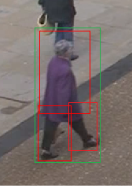

<p align="center">
Figure 1. Image from the original RCNN paper
</p>

This is the 3rd and final part of the Object Detection series and here's where we get down to writing code to implement a RCNN for the Object Detection task. For this post I specifically want to implement a RCNN for detecting people in an image which can be then extended to videos and also the application can then be used to detect overcrowding or detect people in rescue operation with a drone etc.

We will be using the pascal voc dataset for the task which you can download here-[http://host.robots.ox.ac.uk/pascal/VOC/voc2007/](http://host.robots.ox.ac.uk/pascal/VOC/voc2007/) .The dataset has 9000 images with 20 object classes and their annotations(Co-ordinates of bounding boxes) stored in xml files.

To parse these bounding boxes from xml files we will need the xml package.

```py
import os, cv2
import tensorflow as tf
import matplotlib.pyplot as plt
import numpy as np
import xml.etree.ElementTree as ET
import shutil
```

For region proposal we will be working with selective search provided by the cv2 package. While training, regions proposed by selective search are compared with the ground truth values i.e the target bounding box co-ordinates. For regions with high IoU value with ground truth are labelled as foreground. Regions with low IoU score are labelled as background. Here we get two classes upon which we train a CNN model and thus can then extract region proposals for test data.
**To annotate your own data for training the RCNN you can use an excellent tool [LabelImg](https://github.com/tzutalin/labelImg)**
```py
#initialize Selective Search
ss = cv2.ximgproc.segmentation.createSelectiveSearchSegmentation()
#defining our IoU function for our bounding boxes
def get_iou(boxes_preds, boxes_labels, box_format="midpoint"):
    """
    Calculates intersection over union
    Parameters:
        boxes_preds (tensor): Predictions of Bounding Boxes (BATCH_SIZE, 4)
        boxes_labels (tensor): Correct Labels of Boxes (BATCH_SIZE, 4)
        box_format (str): midpoint/corners, if boxes (x,y,w,h) or (x1,y1,x2,y2)
    Returns:
        tensor: Intersection over union for all examples
    """

    # Slicing idx:idx+1 in order to keep tensor dimensionality
    # Doing ... in indexing if there would be additional dimensions
    # Like for Yolo algorithm which would have (N, S, S, 4) in shape
    if box_format == "midpoint":
        box1_x1 = boxes_preds[..., 0:1] - boxes_preds[..., 2:3] / 2
        box1_y1 = boxes_preds[..., 1:2] - boxes_preds[..., 3:4] / 2
        box1_x2 = boxes_preds[..., 0:1] + boxes_preds[..., 2:3] / 2
        box1_y2 = boxes_preds[..., 1:2] + boxes_preds[..., 3:4] / 2
        box2_x1 = boxes_labels[..., 0:1] - boxes_labels[..., 2:3] / 2
        box2_y1 = boxes_labels[..., 1:2] - boxes_labels[..., 3:4] / 2
        box2_x2 = boxes_labels[..., 0:1] + boxes_labels[..., 2:3] / 2
        box2_y2 = boxes_labels[..., 1:2] + boxes_labels[..., 3:4] / 2

    elif box_format == "corners":
        box1_x1 = boxes_preds[..., 0:1]
        box1_y1 = boxes_preds[..., 1:2]
        box1_x2 = boxes_preds[..., 2:3]
        box1_y2 = boxes_preds[..., 3:4]
        box2_x1 = boxes_labels[..., 0:1]
        box2_y1 = boxes_labels[..., 1:2]
        box2_x2 = boxes_labels[..., 2:3]
        box2_y2 = boxes_labels[..., 3:4]

    x1 = torch.max(box1_x1, box2_x1)
    y1 = torch.max(box1_y1, box2_y1)
    x2 = torch.min(box1_x2, box2_x2)
    y2 = torch.min(box1_y2, box2_y2)

    # Need clamp(0) in case they do not intersect, then we want intersection to be 0
    intersection = (x2 - x1).clamp(0) * (y2 - y1).clamp(0)
    box1_area = abs((box1_x2 - box1_x1) * (box1_y2 - box1_y1))
    box2_area = abs((box2_x2 - box2_x1) * (box2_y2 - box2_y1))

    return intersection / (box1_area + box2_area - intersection + 1e-6)
```

**Loading data and defining the background and Foreground class conditions**
```py
path = 'path-to-dataset-images'
annot = 'path-to-dataset-annotations'
foreground = 'images/foreground'  #path to foreground regions
background = 'images/background'   #path to background regions

for e,i in enumerate(os.listdir(annot)):
  try:
    filename = i.split(".")[0]+".jpg"
    print(e,filename)
    image = cv2.imread(os.path.join(path,filename))
    tree = ET.parse(os.path.join(annot, i))
    root = tree.getroot()
    gtvalues=[]
    # get ground truth boxes
    for obj in root.findall('object'):
      if obj.find('name').text == 'person':
        x1 = int(obj.find('bndbox').find('xmin').text)
        y1 = int(obj.find('bndbox').find('ymin').text)
        x2 = int(obj.find('bndbox').find('xmax').text)
        y2 = int(obj.find('bndbox').find('ymax').text)
        gtvalues.append({"x1":x1,"x2":x2,"y1":y1,"y2":y2})
    # generate regions from each image with selective search
    ss.setBaseImage(image)
    ss.switchToSelectiveSearchFast()
    ssresults = ss.process()
    imout = image.copy()
    counter = 0
    falsecounter = 0
    flag = 0
    fflag = 0
    bflag = 0
    for e,result in enumerate(ssresults):
        if e < 2000 and flag == 0:
            for gtval in gtvalues:
                x,y,w,h = result
                iou = get_iou(gtval,{"x1":x,"x2":x+w,"y1":y,"y2":y+h})
                if counter < 30:
                    if iou > 0.70: # foreground class
                        timage = imout[y:y+h,x:x+w]
                        resized = cv2.resize(timage, (224,224), interpolation = cv2.INTER_AREA)
                        cv2.imwrite(os.path.join(foreground, str(counter)+'-'+filename),resized)
                        counter += 1
                else :
                    fflag =1
                if falsecounter <30:
                    if iou < 0.3: # background class
                        timage = imout[y:y+h,x:x+w]
                        resized = cv2.resize(timage, (224,224), interpolation = cv2.INTER_AREA)
                        cv2.imwrite(os.path.join(background, str(counter)+'-'+filename),resized)
                        falsecounter += 1
                else :
                    bflag = 1
            if fflag == 1 and bflag == 1:
                print("inside")
                flag = 1
  except Exception as e:
      print(e)
      print("error in "+filename)
      continue
``` 

**Now we will split the regions in train and test**

```py
for i, file in enumerate(os.listdir(background)):
  if i < 1600:
    shutil.copy(os.path.join(background, file), os.path.join('images/train/background', file))
  elif i < 2100:
    shutil.copy(os.path.join(background, file), os.path.join('images/test/background', file))
  else:
    break


for i, file in enumerate(os.listdir(foreground)):
  if i < 1600:
    shutil.copy(os.path.join(foreground, file), os.path.join('images/train/foreground', file))
  elif i < 2100:
    shutil.copy(os.path.join(foreground, file), os.path.join('images/test/foreground', file))
  else:
    break

```
defining out model (VGG-16)

```py
from tensorflow import keras
from tensorflow.keras.layers import Dense
from tensorflow.keras import Model
from tensorflow.keras import optimizers
from tensorflow.keras.optimizers import Adam

from tensorflow.keras.applications.vgg16 import VGG16

vggmodel = VGG16(weights='imagenet', include_top = True)
for layers in (vggmodel.layers)[:15]:
    print(layers)
    layers.trainable = False
X= vggmodel.layers[-2].output
predictions = Dense(1, activation="sigmoid")(X)
model_final = Model(vggmodel.input, predictions)
opt = Adam(lr=0.0001)
model_final.compile(loss = keras.losses.binary_crossentropy, optimizer = opt, metrics=["accuracy"])
model_final.summary()

```
**Preprocessing the train & test images and resizing them to (224,224)**

```py
train_ds = tf.keras.preprocessing.image_dataset_from_directory(
    "images/train",
    validation_split = 0.2,
    subset = "training",
    seed = 0,
    image_size = (224, 224),
    batch_size = 32
)
val_ds = tf.keras.preprocessing.image_dataset_from_directory(
    "images/test",
    validation_split = 0.2,
    subset = "validation",
    seed = 0,
    image_size = (224, 224),
    batch_size = 32
)
```
**Training the model with .fit() call**
```py
model_final.fit(train_ds, validation_data = val_ds, epochs = 5, callbacks = [callback])
```

**Inference the trained model on test images and plot the bounding boxes on the images with cv2.rectangle()**

```py
for e, i in enumerate(os.listdir(path)):
  if e < 5:
    img = cv2.imread(os.path.join(path, i))
    ss.setBaseImage(img)
    ss.switchToSelectiveSearchFast()
    ssresults = ss.process()
    imout = img.copy()
    for ex, result in enumerate(ssresults):
      if ex < 500:
        x, y, w, h = result
        timage = imout[y:y+h, x:x+w]
        resized = cv2.resize(timage, (224, 224), interpolation = cv2.INTER_AREA)
        img = np.expand_dims(resized, axis = 0)
        out = model_final.predict(img)
        if out[0][0] > 0.7:
          cv2.rectangle(imout, (x, y), (x+w, y+h), (0, 255, 0), 1, cv2.LINE_AA)
    plt.figure()
    plt.imshow(imout)
  else:
    break
```
**Time for results**

<p align="center">

</p>
<p align="center">
Figure 2. BBox for a person in an image not in train/test data. 
</p>

**As you can see the model performs well and has a false positive case if the second highest confident bbox is considered,we can further improve our model by tuning the hyperparameters and using normal selective search instead of fast selective search.**

So that's it folks,with this I will wrap up the **From classifying objects to detecting them** series, see you in the next post. \
Bye,for now 👋.