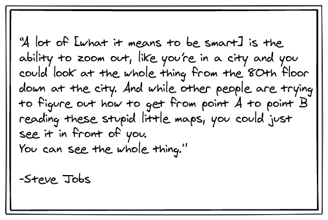

This is a small non technical post about a mental model around solving problems.Steve Jobs  once said:

While this quote seems so simple to grasp but I couldn't figure out how to apply it to practical use until recently, when in an interview I was asked a to formulate a solution to a problem and I immediately dived into the specifics of how I'd choose a dictionary over the list data structure to reduce time complexity and save a few megs of RAM etc. The interviewer stopped me there and recommended to think upon the problem once more, to which I thought I have a good solution and I'm sure this will yield desired results so I continued and he stopped me again to explain how the code I was going to write was unnecessarily long and twisted.As an alternate approach he suggested to form an algorithm around how a human brain solves the problem and then convert it into code. We walked through the algorithm together and as it turned out this approach was inherently optimized and led to cleaner code as well. This taught me a lesson of how the step 1 of my problem solving was flawed and I needed to zoom out before going deeper into the specifics of the problem.

Another example I noticed after this incident was that when adding a new component to my react native app, I immediately started thinking about how the component should be made,its styling,animations to be used if any.Mindlessly adding it without zooming out and considering it's effects on other components or it's structure within the app which may lead to problems in the future and without considering UX or even if the users would want such a feature or not.

These are examples from my programming experience I'm sure there are lots of others in the daily life.But if you want to take away a lesson from this post I'd want it to be this-

**Don't optimize things around the pieces involved in the process of the task but zoom out and optimize the whole process around the desired results.**